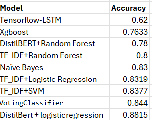

# onion
Dataset of The Onion articles and real "Onion-like" news articles from the subreddit r/NotTheOnion, along with a jupyter notebook extracting the dataset and performing classification. The Onion articles are labeled 1 and the r/NotTheOnion articles are labeled 0.

The data was pre-processed, and then feature extraction was done on the processed data. Using this data, we trained several different models, and their accuracies can be seen in the image.

We got maximum metrics by using  DistilBERT for Sequence Classification and DistilBERT Tokenizer for tokenization.
The Training Process was done using AdamW Optimizer with a learning rate scheduler for 10 epochs. 

The final metrics are:
Accuracy: 0.9199
F1 Score: 0.8901
Precision: 0.9167
Recall: 0.8650

The task was distributed amongst all team members equally, where we tested and tried for different solutions.